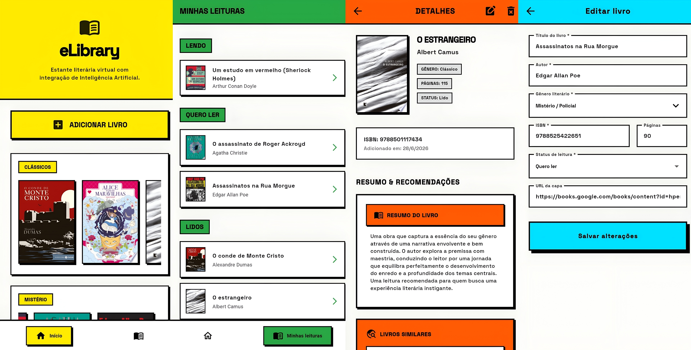

# eLibrary


Um aplicativo mobile em Flutter focado em organização de estante literária, utilizando inteligência artificial para geração de resumos e recomendações de livros, além de integração de machine learning para catalogação rápida.

## 🔴 Sobre

O eLibrary foi desenvolvido com o objetivo de criar uma solução prática para catalogação de livros. O sistema implementa gerenciamento de estado (BLoC), persistência em nuvem (Firebase Firestore), integração com IA Generativa (Google Gemini), API externa de catálogo livros (Google Books API) e processamento de imagem (Google ML Kit).



## 🟠 Funcionalidades

**1. Gerenciamento de estante (Auth + CRUD)**

- [x] Arquitetura baseada no padrão BLoC (Business Logic Component) para separação clara de responsabilidades;
- [x] Autenticação segura via Firebase Authentication;
- [x] Persistência de dados em tempo real utilizando Firebase Firestore;
- [x] CRUD completo de livros: adicionar, listar, atualizar status de leitura e excluir;
- [x] Filtragem dinâmica de livros por categorias e status (Lendo, Quero Ler, Lidos, Abandonados).

**2. Catalogação inteligente (ML Kit)**

- [x] Integração com Google ML Kit para escaneamento de códigos de barras (ISBN);
- [x] Busca automática de metadados de livros diretamente da API do Google Books a partir do ISBN escaneado.

**3. Inteligência artificial (Gemini API)**

- [x] Geração automática de sinopses curtas;
- [x] Recomendação de 3 livros similares baseados no gênero da obra;
- [x] Tratamento de erros de API com fallback para textos genéricos em caso de indisponibilidade do Gemini.

O aplicativo ainda conta com uma estilização em neobrutalismo (cores fortes, sombras contrastantes e bordas marcadas).

## 🟡 Execução

**Pré-requisitos:** SDK do Flutter instalado e conta no Firebase configurada.

```bash
# Clone o repositório
git clone https://github.com/barbarastella/elibrary-app

# Acesse a pasta
cd elibrary-app

# Configure as seguintes variáveis de ambiente baseadas no .env.example
# GOOGLE_WEB_CLIENT_ID: chave do OAuth Client ID para autenticação do Google
# GOOGLE_BOOKS_API_KEY: chave da Google Books API
# GEMINI_API_KEY: chave da API do Gemini

# Instale as dependências
flutter pub get

# Rode o aplicativo
flutter run
```

## 🟢 Contato

<p align="left">
  Em caso de dúvidas ou comentários, entre em contato:&nbsp;
  
  <a href="https://www.linkedin.com/in/barbara-wehrmann/" title="LinkedIn">
    
  </a>
  <a href="mailto:barbarastellaw@gmail.com" title="Gmail">
    
  </a>
  <a href="https://www.instagram.com/barbarastellaw" title="Instagram">
    
  </a>
</p>
